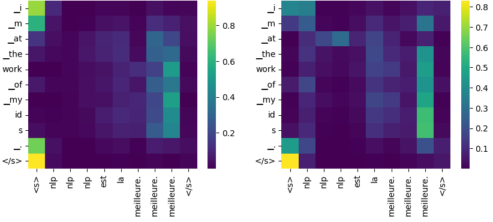
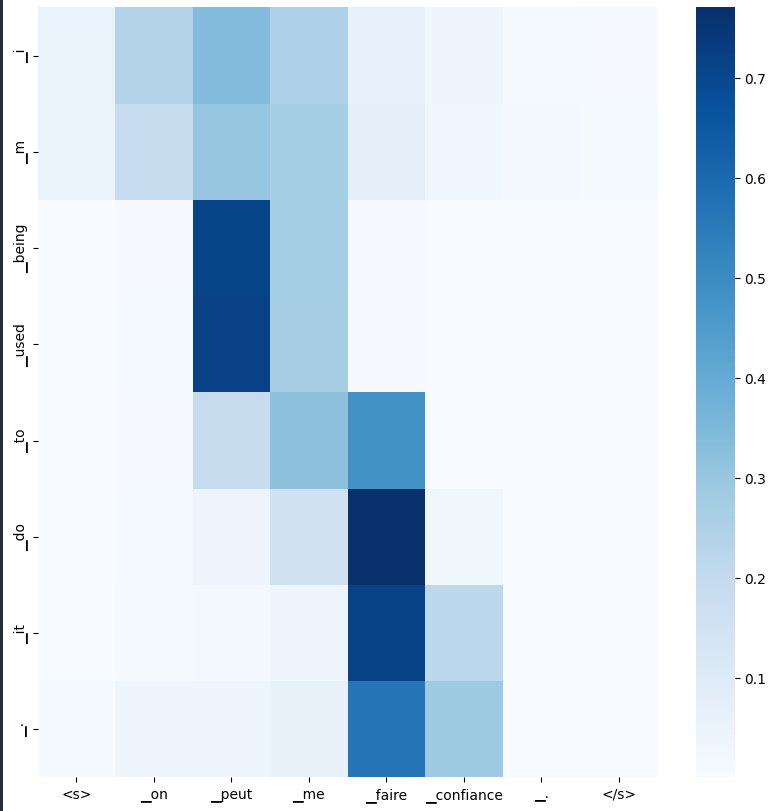

# French-to-English NMT

---

## 👥 Team Members

1. [**Mohamed Hassan**](https://github.com/mohassan5286)
2. [**Omar Hany**](https://github.com/OmarHani4306)
3. [**Mohamed Mohamed Ibrahim**](https://github.com/Mohamed-Mohamed-Ibrahim)

---

## 📋 Objective

This project implements two **Sequence-to-Sequence** **(Seq2Seq)** models to build a Neural Machine Translation (NMT) system capable of translating **French to English**.

The two architectures implemented are:

1. **Transformer:** A simplified Encoder-Decoder Transformer model.
2. **Recurrent Neural Network (RNN):** A Bi-LSTM Encoder and Unidirectional LSTM Decoder with Additive Attention.

---

## 🏆 Results

We evaluated both models using the BLEU-4 score metric.

| Model | BLEU-4 Score |
| --- | --- |
| **RNN (Bi-LSTM + Attention)** | **54.29** |
| **Transformer** | **52.17** |

---

### 🖼️ Visual Results

#### **Transformer Multi-Head Attention**

    
  <em>Figure 1: Transformer attention heatmap.</em>

#### **RNN Additive Attention**

    
  <em>Figure 2: RNN attention heatmap.</em>

---

## 📂 Dataset

* **Source:** Parallel French and English sentences (partitioned into train, validation, and test splits).
* **Tokenization:** Byte Pair Encoding (BPE) is used to handle rare words by splitting them into subword tokens.
* **Resources:** Tokenizers for French and English are provided via the problem statement resources.

---

## ⚠️ Note on Data Leakage & Evaluation

During the evaluation phase, we identified a **data leakage** issue within the provided dataset splits. 

### 🔍 Observations

* **The Issue:** We discovered that several sentence pairs in the test set were also present in the training data about 10%.
* **Impact:** This resulted in inflated BLEU scores (54.29 for RNN and 52.17 for Transformer), as the models were able to "memorize" certain translations rather than generalizing entirely from scratch.

---

## 🏗️ Part 1: Transformer-Based Architecture

We implemented a modified version of the standard Transformer architecture.

### Key Modifications

* **Positional Embeddings:** Used **learned** positional embeddings instead of sinusoidal ones.
* **Dropout:** No dropout applied in the embedding layer or attention weights.
* **Weight Tying:** Weights are tied between the decoder’s input embeddings and the output projection matrix.

### Architecture Details

1. **Embeddings:** Sum of Token Embeddings and Learned Positional Embeddings.
   - Decoder uses separate embedding matrices.

2. **Multi-Head Attention:**
   - Implemented manually (vectorized) without using `nn.MultiheadAttention`.
   - Uses **Scaled Dot-Product Attention**.

3. **Masking:** 
   - Pad tokens are masked with large negative values. The decoder uses causal masking to prevent attending to future tokens.

4. **Feedforward Layers:**
   - Projects to intermediate dimension , applies ReLU, projects back, and applies dropout.

5. **Add & Norm:** 
   - Residual connections and Layer Normalization applied after attention and feedforward blocks.

---

## 🔄 Part 2: RNN-Based Architecture

This model utilizes Recurrent Neural Networks with an **Additive Attention** mechanism.

### Architecture Details

1. **Encoder (Bi-LSTM):**
   - Consists of two LSTMs processing sequences in opposite directions.
   - Final hidden state is the concatenation of forward and backward states.

2. **Decoder Initialization:**
   - Projects the encoder's final hidden/cell states to match decoder dimensions using a linear layer and `tanh` activation.

3. **Additive Attention:**
   - Computes alignment scores using a feed-forward network rather than dot-product:

4. **Context vector:**  
   - is the weighted sum of encoder hidden states based on softmax-normalized scores.

5. **Decoder Step:**
   - Input: Concatenation of previous token embedding  and context vector.
   - Output Projection: Concatenation to predict the next token.

---

## ⚙️ Implementation Notes

* **Tokenization:** The `transformers` library is used **only** for tokenization.
* **Manual Implementation:** * The Multi-Head Attention module is implemented from scratch (vectorized).
    - The Embedding layer (Token + Positional) is implemented manually.
    - Beam Search decoding algorithm is implemented for inference.

* **Inference:**
    - Models are evaluated using **BLEU** score.
    - **Beam Search** is used for generating translations.

* **Visualization:** Attention weights are visualized to interpret model focus during translation.
* **Checkpoints:** System supports saving and loading model states.

---